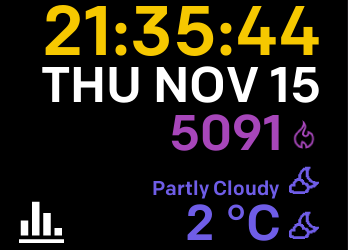

# metrix-fitbit
A Fitbit Ionic watch face showing metrics activities.

## Resources

Icons are provided by:

* [Fitbit](https://github.com/Fitbit/sdk-design-assets)
* Icons made by [Smashicons](https://www.flaticon.com/authors/smashicons) from [www.flaticon.com](https://www.flaticon.com/") is licensed by [CC 3.0 BY](http://creativecommons.org/licenses/by/3.0)
