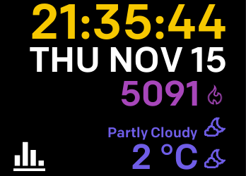
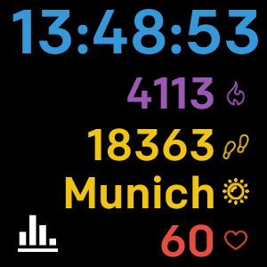
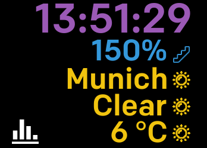
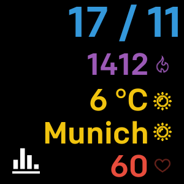
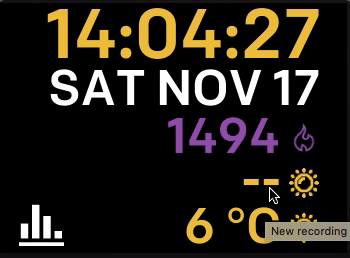
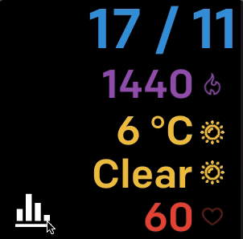
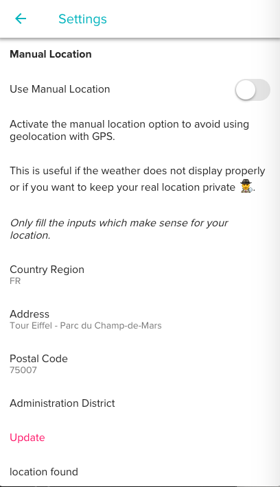

# metrix-fitbit

A Fitbit Ionic & Versa clock face showing metrics activities.

You can change each metric to one of the 9 available. You can even have the same activity multiple times and showing different stats format.

For example, for steps, you could show both:

* the total steps
* percentage achievement goal

| Ionic | Versa |
|----------|:-------------:|
|  |  |
|  |  |
|  | |

## Changelog

### 05/03/19

;

* Add battery metric indicator
* Add miles units for distance metric
* Add lock clock face UI in settings app
* Add manual location for weather
* Add a reset all metrics (panic) button

### 29/11/18

* You can now personalize metric's color
* Metric's color personalization can be reset in mobile settings
* Add new time and date format
* Add new colors for metrics and background
* Add donation button (mostly for weather API)

## Features

* Colorful design
* 9 available metrics (clock, weather, calories, ...)
* 3 different states meter (total, percent, missing/over)
* The switch mode button let you be in 2 different states:
  * **Stats:** you can change between 3 differents stats for metric value (total, percent, missing/over) _(note that some metric don't necessarly have all stats like the clock metric)_
  * **Next:** switch to the next available activity

## Activities metrics

* active minutes
* battery level
* calories
* clock
* date
* distance
* elevation gain
* heart rate
* steps
* weather

## Permissions and Privacy

Because this clock face shows personal goals, heart rate and weather data, it uses these exact same information:

* Personal goals (steps, calories, distance, ...)
* Heart rate sensor
* **GPS location** for the weather

No data is kept nor send to first or third parties entities, companies or individuals. You can check by looking at the source code.

When installing the clock face, it'll ask you for these permissions. You can deny all, some or none. The non-functional activities metrics won't show on the clock face in that case.

## Ionic & Versa

The clock face support both Ionic & Versa with a layout adaptation.

## Settings

In the settings, you can change the color background of the clock face and you can find some contact information.

## Weather

The weather data is provided by [DarkSky](https://darksky.net).

You can change the refresh time rate in the settings. By default, the cache lasts 1 hour (60 min).

Weather data is only updated when the clock face is active (i.e. screen turned on) and is not updated in background every X time. This is because there's a usage limite of the API.

As I pay for for the DarkSky API usage, I can't afford all API requests. Feel free to support the clock face if you use this daily. Feel free to help me with the cost by donating some penies.

_Because there's a API usage limit, the weather data may not update right away. This will depend on the amount of users using this clock face._

## GPS

By default, the weather uses the device GPS if available (for Ionic).

If the device doen't have one (like the Versa), the weather will try to use the phone's GPS.

However, if sometimes it doesn't work or if you want to use a manual location, you can set one through the (mobile) companion's settings app.

* Activate the 'Use Manual Location' toggle
* Fill the address values
* Tap on the 'Update' button

## Contributing

Feel free to contribute to this project by:

* Opening a PR with a change proposition
* Openning an issue if
  * you want to propose a new feature
  * or if you encounter a problem
* Pay me a tea

## Resources

Acitivities icons are provided by:

* [Fitbit's icons](https://github.com/Fitbit/sdk-design-assets)

Weather API wrapper is provided by:

* [fitbit-weather](https://github.com/gregoiresage/fitbit-weather)

Weather icons are from [www.flaticon.com](https://www.flaticon.com/"), is licensed by [CC 3.0 BY](http://creativecommons.org/licenses/by/3.0), and provided by:

* [Good Ware](https://www.flaticon.com/authors/good-ware)
* [Freepik](https://www.freepik.com)
* [Iconixar](https://www.flaticon.com/authors/iconixar)
* [RNS](https://www.flaticon.com/authors/rns)
* [Smalicons](https://www.flaticon.com/authors/smashicons)
* [Yannick](https://www.flaticon.com/authors/yannick)

## Licence

This project is under MIT Licence.

## Support

[Support OSS by paying me a beer](https://www.paypal.me/rootasjey) 🍺

Thank you if you decide to help me :)
